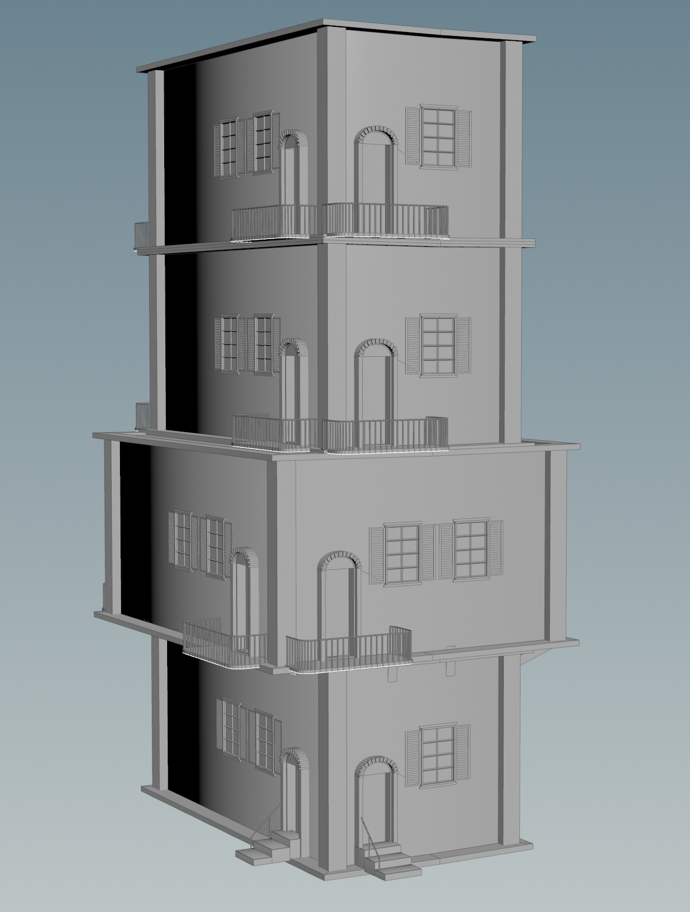
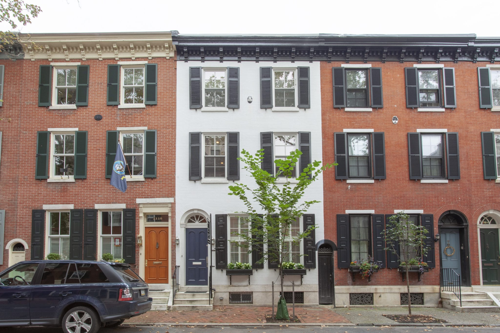
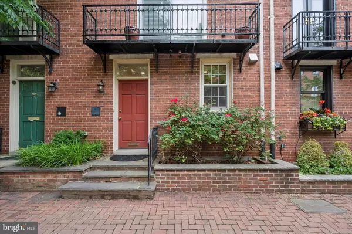

# CIS 5660 HW03 Procedural Buildings

[Demo video](https://www.youtube.com/watch?v=ZyD3Q-5D_xM)

Procedural buildings made in Houdini, following general outline from [this Simon Houdini tutorial](https://www.youtube.com/watch?v=uIe97023sDk&t=979s), wiht building features designed from scratch (doors, stairs, balconies, and windows). The intent here was to modulate the overwatch style expressed in the tutorial with a Philadelphia townhouse flavor. Here are some inspirational photos I referenced in modeling the windows and doors, specifically:

Obviously, with real townhouses, there's a lot more regularity - doors are in the same place on the front side of the building, windows are regularly spaced. But where's the fun in that? With proceduralism, you can randomize everything! In the demo video above, you can see how with a single procedural model, you can derive a multitude of varied models - the windows I made, for instance, feature different dimensions (both height and width, and number of glass panes in both directions), the ability to change the shutter angle, and the shutter doors even close!

Future direction: to really sell this, I'd want to do some UV mapping and put some brick textures on the walls and door frames, among other texturing.
